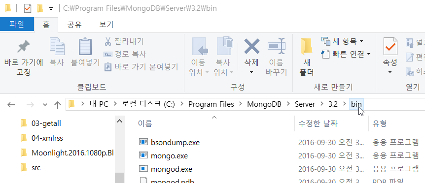
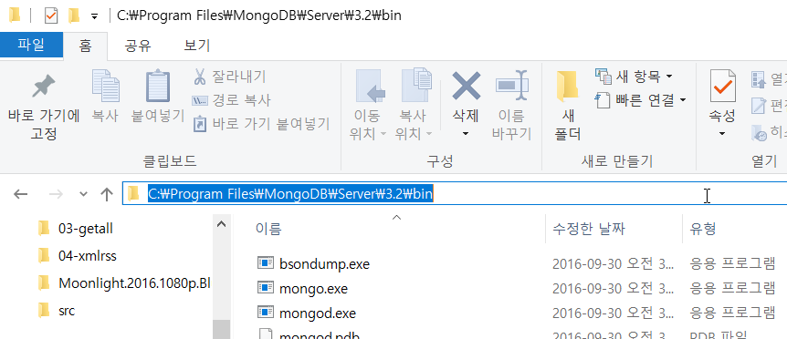
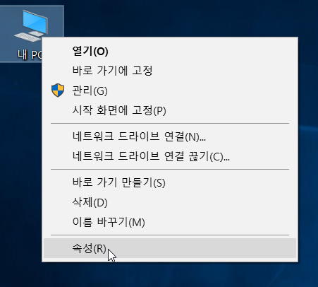
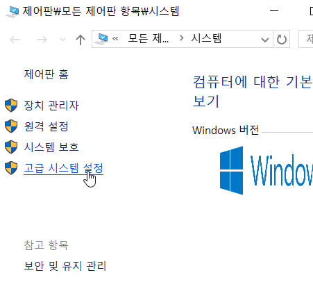
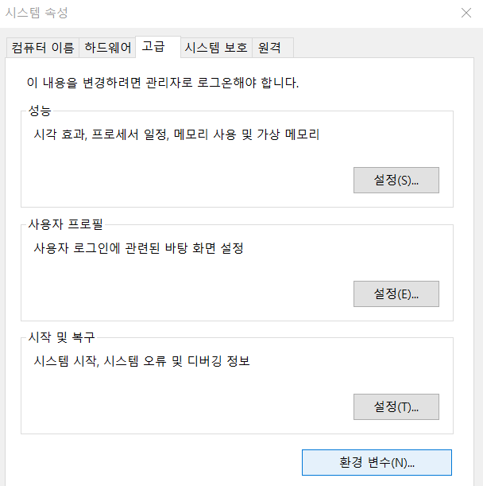
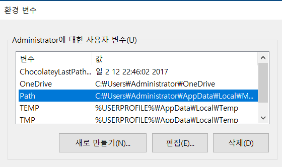
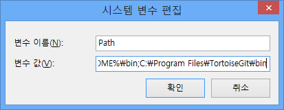
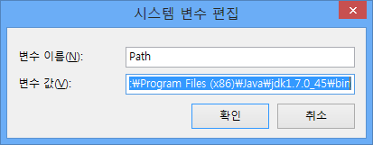

# 윈도우즈에서 MongoDB 환경변수 세팅하기

## 1. 몽고디비 설치 경로의 `Server/3.x/bin` 폴더로 이동합니다.

## 2. 주소창을 클릭하고 `Ctrl+C`로 클립보드에 경로를 복사합니다.

## 3. 바탕화면의 '내컴퓨터'아이콘을 우클릭하여 '속성'을 선택합니다.

> 혹은 `제어판 > 시스템`으로 이동하여도 됩니다.

## 4. 좌측 하단의 `고급 시스템 설정`을 클릭합니다.

## 5. 우측 최하단의 `환경변수` 버튼을 클릭합니다.

## 6-1. 상단의 '사용자변수' 또는 '시스템 변수' 중 `Path`가 있다면, 이를 더블클릭(혹은 '편집'버튼 클릭)합니다.

## 6-2. `Path`가 없을 경우, '새로 만들기'를 클릭하여 변수 이름에 `Path`라고 적어주세요.

## 7-1. Win10 : `새로만들기`를 클릭하고, `Ctrl+V`로 붙여넣기 합니다.

## 7-2. Win7 : '변수 값'에 이미 입력된 내용이 있는 경우, 내용 맨 뒤 `;`을 입력한 다음, `Ctrl+V`로 붙여넣기 합니다.
> !!! 기존에 입력되어 있던 내용이 지워지면 절대로 안됩니다 !!!

## 8. `확인`을 클릭하여 보이는 창을 모두 닫습니다.

## 9. 터미널을 닫고 새로 열어 아무 경로에서나 `mongod`를 실행해보세요.
다음과 같은 내용이 나오면서 실행이 되면 성공입니다!

