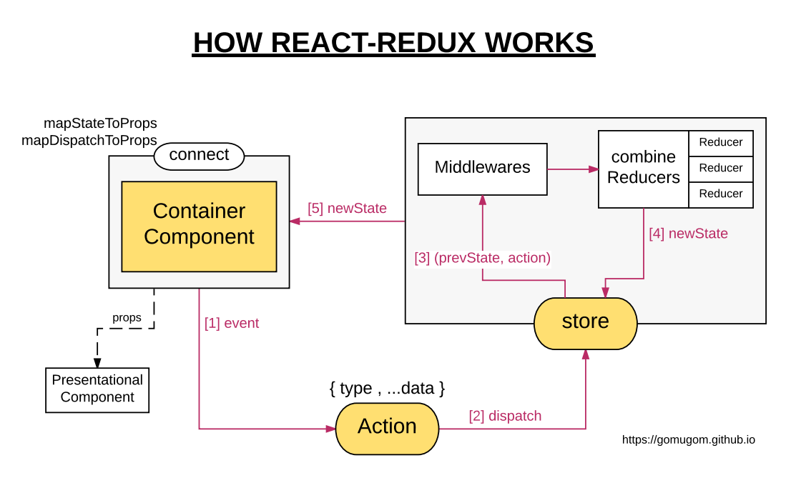

# Ch 8. Redux 1

### 1) 개요

https://dobbit.github.io/redux/

> 여러분의 앱의 상태 전부는 하나의 `스토어(store)`안에 있는 객체 트리에 저장됩니다.
>
> 상태 트리를 변경하는 유일한 방법은 무엇이 일어날지 서술하는 객체인 `액션(action)`을 보내는 것 뿐입니다.
>
> 액션이 상태 트리를 어떻게 변경할지 명시하기 위해 여러분은 `리듀서(reducers)`를 작성해야 합니다.
>
> 이게 다입니다!


### 2) Presentational component vs. Container component

- [프리젠테이셔널 vs. 컨테이너 컴포넌트](http://redux.js.org/docs/basics/UsageWithReact.html#presentational-and-container-components)
- [영민한 vs. 우둔한 컴포넌트 - 제작자의 실수 인정](https://medium.com/@dan_abramov/smart-and-dumb-components-7ca2f9a7c7d0#.5i4yjbprz)


| | Presentational Components	| Container Components |
| :-: | --- | --- |
| Purpose |	How things look (markup, styles) | How things work (data fetching, state updates) |
| Aware of Redux |	No | Yes |
| To read data	| Read data from props | Subscribe to Redux state |
| To change data	| Invoke callbacks from props	| Dispatch Redux actions |
| Are written | By hand	| Usually generated by React Redux |




### 3) 구조

> 변경전

```
- main
- App
  - InputBox     : input, button['save'], button['withdraw']
  - AccountBook  : data table
```

> 변경후

```
- main
- store            : 모든 상태 정보를 저장하고 있는 저장소.
- [actions]        : 상태 변경을 위한 '명령' 기술
  - BankActions
- [containers]     : store에서 필요한 state들을 추출하여 props에 반영.
  - App
- [components]     : container에서 전달한 props들을 사용.
    - InputBox     : button 클릭시 select type과 input value를 토대로 액션 호출.
    - AccountBook
- [reducers]       : 실제 상태 변경을 수행하여 store를 갱신함.
  - BankReducer
```

### 4) 설치

```bash
> npm i -S redux react-redux
```

### 5) Redux DevTool
